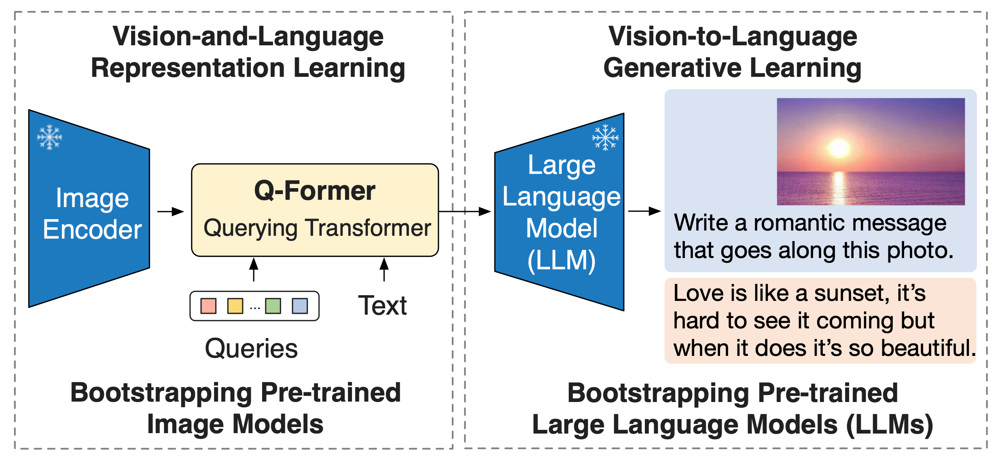
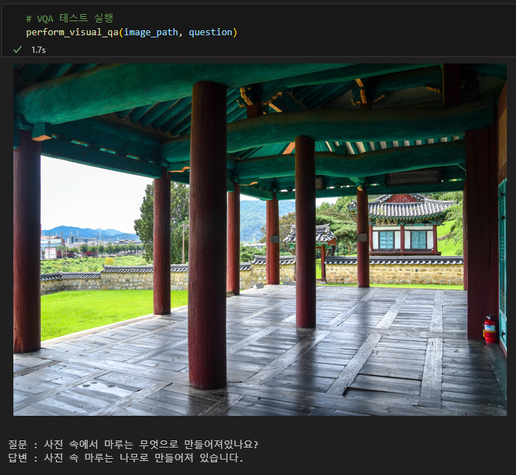

# 한국어 GQA 데이터 질의응답을 위한 Bootstrapping Language-Image Pre-training with Frozen Image Encoders and Large Language Models (BLIP-2)

본 레포지토리는 한국어 GQA 데이터셋에 특화된 [BLIP-2](https://github.com/salesforce/LAVIS/tree/main/projects/blip2)의 학습 및 추론 코드를 제공합니다.  
원본 코드는 salesforce의 [BLIP-2](https://github.com/salesforce/LAVIS/tree/main/projects/blip2)임을 밝힙니다.
사용자를 위한 AI 모델, 저작권 및 라이센스 세부 정보를 제공합니다.


### 모델 정보:
------------------
BLIP-2 모델은 대규모 모델의 종단간(end-to-end) 사전 학습 비용이 점점 더 많이 드는 문제를 해결하기 위해 제안된 비전-언어 사전 학습 전략입니다. 
기존에 사전 훈련된 이미지 인코더와 대규모 언어 모델을 그대로 활용(가중치 freeze)하여 비전-언어 표현 학습을 시작합니다.

BLIP-2는 모달리티 간의 간격을 'Querying Transformer'라는 가벼운 변환 모델을 통해 연결합니다. 이는 두 단계의 사전 학습 과정을 거칩니다. 첫 번째 단계에서는 고정된 이미지 인코더로부터 비전-언어 표현 학습을 시작합니다. 두 번째 단계에서는 고정된 언어 모델로부터 비전-언어 생성 학습을 시작하여, 이미지에서 텍스트로의 변환 능력을 배웁니다.

이 모델은 비전-언어 관련 다양한 작업에서 최고의 성능을 달성했음에도 불구하고, 기존의 방법들에 비해 훨씬 적은 수의 학습 가능한 파라미터를 가지고 있습니다. 
예를 들어, BLIP-2는 학습 가능한 파라미터가 54배 적음에도 불구하고, 제로샷 VQAv2에서 Flamingo80B 모델보다 8.7% 더 높은 성능을 보여줍니다.  
BLIP-2 모델의 대략적인 구조는 아래와 같습니다. 



### 변경 사항:
------------------
- 비전 인코더 변경 : 기존의 BLIP-2 모델은 224x224 이미지를 활용하는 구조를 가지고 있습니다. 본 레포지토리에서 사용하는 이미지는 고해상도 이미지에 작은 객체가 포함되어 있으므로 224x224로이미지를 resize하면 객체가 소멸되는 문제가 발생합니다. 따라서 560x560 사이즈의 이미지를 사용하는 비전 인코더로 모델 구조 일부를 변경하여 사용하였습니다. 
- 언어 모델 변경 : 기존의 BLIP-2 모델의 언어모델은 한국어를 지원하지 않으므로 PAUST에서 만든 한국어로 학습된 [Chat T5](https://huggingface.co/paust/pko-chat-t5-large) 모델을 사용했습니다.
- 한국어 사전학습 모델 사용 : 사전학습을 위해 한국어로 번역된 MSCOCO 데이터 및 train 데이터의 일부를 사용했습니다. 


### 학습 환경:
------------------ 
- 본 레포지토리의 실험 환경은 다음과 같습니다. 원활한 학습 및 추론을 위해 최소 25GB 이상의 GPU 사용을 권장드립니다.  
- GPU : Tesla V100 GPU * 4장 
- CPU : Intel(R) Xeon(R) CPU E5-2698 v4 @ 2.20GHz
- RAM : 924 GB 
- 운영체제 : Ubuntu (20.04.6 LTS)
- CUDA : 11.7
- Framework :  Python 3.8.10, Pytorch 2.0.1


### 학습 준비:
------------------  
##### 필수 라이브러리 설치
```bash
pip3 install -r requirements.txt
```  
##### 데이터셋 내려받기 
- 현 시점 기준으로 한국어GQA 데이터는 아직 공개되지 않았습니다.곧 AI허브에 업로드 될 예정이니 해당 홈페이지에서 데이터셋을 다운받아 준비해주세요. 

##### 데이터 전처리
```bash
python3 preprocess.py
```  

#### 사전학습모델 내려받기(선택사항)
- 업데이트 예정


### 학습 시작 방법:
------------------
- 이 섹션에서는 모델 학습을 시작하는 방법을 안내합니다. 단일 GPU 또는 다중 GPU 환경에 따라 다른 명령어를 사용합니다. 배치 사이즈와 같은 학습 조건은 argparse를 통해 커맨드 라인에서 직접 조정할 수 있습니다.


```bash  
# 단일 GPU를 사용하는 경우:
python3 train.py 
# 다중 GPU를 사용하는 경우:
accelerate launch --config_file multi_gpu_config.yaml train_multi.py
```

- 매 학습 주기(step)마다 학습 점수와 검증 점수를 확인하실 수 있습니다('output/result.csv').  
검증 데이터셋 기준으로 가장 좋은 모델은 `output` 디렉토리 아래 model_best.pth 이름으로 저장되며 학습 중 갱신됩니다.


### 추론 실행 방법: 
------------------ 

- 모델을 사용하여 테스트 데이터셋에 대한 추론을 수행하는 방법입니다. 
테스트 데이터셋의 추론 결과는 test_result_final.csv 파일에 저장됩니다.  
```bash
# 단일 GPU를 사용하는 경우:
python3 test.py 
# 다중 GPU를 사용하는 경우:
accelerate launch --config_file multi_gpu_config.yaml test_multi.py
 
``` 
- 임의의 낱개 이미지로 개별 추론을 진행하려면, inference.ipynb 파일을 실행하세요. 




### 논문 인용:
------------------
- 연구 목적으로 이 코드 저장소의 일부를 사용하신다면 다음 논문들을 인용해주시면 감사하겠습니다.

```
@inproceedings{li2023blip2,
      title={{BLIP-2:} Bootstrapping Language-Image Pre-training with Frozen Image Encoders and Large Language Models}, 
      author={Junnan Li and Dongxu Li and Silvio Savarese and Steven Hoi},
      year={2023},
      booktitle={ICML},
}
```


Copyright:
-----------------
BSD 3-Clause License

Copyright (c) 2022 Salesforce, Inc.
All rights reserved.

License Full Text:
------------------
Redistribution and use in source and binary forms, with or without modification, are permitted provided that the following conditions are met:

1. Redistributions of source code must retain the above copyright notice, this list of conditions, and the following disclaimer.

2. Redistributions in binary form must reproduce the above copyright notice, this list of conditions, and the following disclaimer in the documentation and/or other materials provided with the distribution.

3. Neither the name of Salesforce.com nor the names of its contributors may be used to endorse or promote products derived from this software without specific prior written permission.

THIS SOFTWARE IS PROVIDED BY THE COPYRIGHT HOLDERS AND CONTRIBUTORS "AS IS" AND ANY EXPRESS OR IMPLIED WARRANTIES, INCLUDING, BUT NOT LIMITED TO, THE IMPLIED WARRANTIES OF MERCHANTABILITY AND FITNESS FOR A PARTICULAR PURPOSE ARE DISCLAIMED. IN NO EVENT SHALL THE COPYRIGHT HOLDER OR CONTRIBUTORS BE LIABLE FOR ANY DIRECT, INDIRECT, INCIDENTAL, SPECIAL, EXEMPLARY, OR CONSEQUENTIAL DAMAGES (INCLUDING, BUT NOT LIMITED TO, PROCUREMENT OF SUBSTITUTE GOODS OR SERVICES; LOSS OF USE, DATA, OR PROFITS; OR BUSINESS INTERRUPTION) HOWEVER CAUSED AND ON ANY THEORY OF LIABILITY, WHETHER IN CONTRACT, STRICT LIABILITY, OR TORT (INCLUDING NEGLIGENCE OR OTHERWISE) ARISING IN ANY WAY OUT OF THE USE OF THIS SOFTWARE, EVEN IF ADVISED OF THE POSSIBILITY OF SUCH DAMAGE.

Please adhere to the above license terms and conditions when using this model. For any queries or further clarification, feel free to reach out to our support team.

Thank you for choosing our AI model for your applications.
